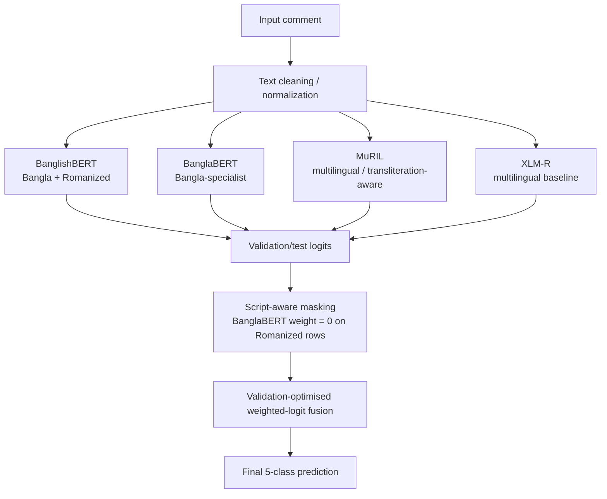

<!-- README.md -->

<h1 align="center">BanglaCyberBench</h1>

<p align="center">
  <b>A Multi-Source, Dual-Script Benchmark and Script-Aware Transformer Ensemble<br/>
  for Robust Fine-Grained Bengali Cyberbullying Detection</b>
</p>

<p align="center">
  
  
  
  
  
  
</p>

---

## Overview

**BanglaCyberBench** is a deduplicated, multi-source, dual-script benchmark for fine-grained Bengali cyberbullying detection. It merges four public Bengali/Bangla cyberbullying and abuse-detection datasets into a unified benchmark of **94,323 unique comments**, covering both **Bangla script** and **Romanized Bangla**.

The project addresses four major gaps in prior Bengali cyberbullying research:

1. Most studies use **one dataset/source**.
2. Most studies evaluate only **Bangla script**, not Romanized Bangla.
3. Most datasets use incompatible or coarse labels.
4. Most evaluations report only in-domain performance and do **not** test robustness under source/script shift.

This repository contains the complete research pipeline:

```text
dataset inventory → preprocessing → label consolidation → splits → baselines
→ transformer fine-tuning → proposed ensemble → robustness tests
→ ablations → base-paper comparison → paper-ready figures/tables
```

The main proposed system is a **script-aware weighted-logit transformer ensemble** using BanglishBERT, BanglaBERT, MuRIL, and XLM-R. The final proposed model achieves:

> **Macro-F1 0.8225**, **Weighted-F1 0.8332**, **Accuracy 0.8339**, **MCC 0.7452**, and **Macro-AUROC 0.9626** on the official 20% in-domain test split.

---

## Key Contributions

1. **BanglaCyberBench benchmark**
   - Four public sources merged into one benchmark.
   - Final deduplicated size: **94,323 unique comments**.
   - Dual-script coverage: **Bangla script + Romanized Bangla**.
   - Unified schema: `text`, `text_clean`, `label_binary`, `label_type`, `label5`, `source`, `script`, `uid`.

2. **Fine-grained 5-class taxonomy**
   - Final labels: `none`, `abusive`, `sexual`, `religious`, `threat`.
   - Consolidated from heterogeneous raw labels using the priority rule:

```text
threat > sexual > religious > abusive > none
```

3. **Main proposed model: script-aware transformer ensemble**
   - Four encoder families:
     - BanglishBERT
     - BanglaBERT
     - MuRIL
     - XLM-R
   - Each encoder is fine-tuned with a minimal but effective recipe:
     - Cross-entropy loss
     - FGM adversarial training
   - Final prediction uses validation-optimised weighted-logit fusion.
   - BanglaBERT is treated as a Bangla-script specialist and is masked off on Romanized rows.

4. **Robustness evaluation**
   - Official in-domain 70/10/20 split.
   - Source-held-out evaluation.
   - Script-held-out evaluation.
   - All split protocols enforce no train/test overlap through `uid` intersection checks.

5. **Base-paper comparison**
   - Like-for-like comparison against Hoque & Seddiqui's Facebook-44K, 5-class protocol.
   - Proposed model is slightly below the base paper overall but improves the difficult `Threat` class.

---

## Final Benchmark Summary

### Dataset Sources

| Source | Script | Origin | Final samples |
|---|---|---:|---:|
| `facebook_44001` | Bangla | Mendeley | 43,078 |
| `banth` | Romanized | Kaggle | 37,334 |
| `multilabel_12557` | Bangla | Kaggle | 8,882 |
| `bd_shs` | Bangla | Mendeley | 5,029 |
| **Total** | — | — | **94,323** |

### Script Distribution

| Script | Samples | Share |
|---|---:|---:|
| Bangla script | 56,989 | 60.4% |
| Romanized Bangla | 37,334 | 39.6% |
| **Total** | **94,323** | **100.0%** |

### Class Distribution

| Class | Samples | Share |
|---|---:|---:|
| `none` | 47,312 | 50.2% |
| `abusive` | 24,963 | 26.5% |
| `sexual` | 10,822 | 11.5% |
| `religious` | 8,032 | 8.5% |
| `threat` | 3,194 | 3.4% |
| **Total** | **94,323** | **100.0%** |

The dataset is strongly imbalanced. The `none` class dominates, while `threat` is the rarest and most safety-critical class. This is why **Macro-F1** is used as the primary metric.

---

## Splits

The main in-domain setting uses a stratified **70/10/20** split on `label5`.

| Split | Samples |
|---|---:|
| Train | 66,026 |
| Validation | 9,432 |
| Test | 18,865 |
| **Total** | **94,323** |

Additional robustness protocols:

| Protocol | Description |
|---|---|
| Source-held-out | Train on three sources, test on the held-out source |
| Script-held-out | Train on one script, test on the held-out script |

Every split uses a hard `uid` overlap assertion to prevent duplicate leakage.

---

## Proposed Model

The main proposed system is a **script-aware transformer ensemble**.



### Encoder Roles

| Encoder | Hugging Face ID | Role |
|---|---|---|
| BanglishBERT | `csebuetnlp/banglishbert` | Bilingual Bangla + Romanized encoder |
| BanglaBERT | `csebuetnlp/banglabert` | Bangla-script specialist |
| MuRIL | `google/muril-base-cased` | Multilingual / transliteration-sensitive encoder |
| XLM-R | `xlm-roberta-base` | Multilingual baseline encoder |

### Training Recipe

| Component | Setting |
|---|---|
| Loss | Cross-entropy |
| Adversarial training | FGM |
| Seeds | 42, 123, 456 |
| Max length | 128 |
| Precision | fp16 mixed precision |
| Primary metric | Macro-F1 |
| Fusion | Validation-optimised weighted-logit ensemble |
| Script handling | BanglaBERT masked on Romanized rows |

---

## Main Results

### Official 20% In-Domain Test

| Model | Macro-F1 | Weighted-F1 | Accuracy | MCC | Macro-AUROC |
|---|---:|---:|---:|---:|---:|
| **Proposed model** | **0.8225** | **0.8332** | **0.8339** | **0.7452** | **0.9626** |
| Alternate full-stack BanglishBERT | 0.8135 | 0.8224 | 0.8222 | 0.7291 | 0.9534 |

### Proposed Model Per-Class F1

| Class | F1 |
|---|---:|
| `abusive` | 0.7397 |
| `none` | 0.8771 |
| `religious` | 0.9031 |
| `sexual` | 0.8238 |
| `threat` | 0.7689 |

### Confusion Matrix

The final proposed model is evaluated on the official 20% test split with **18,865** examples.

| True \ Predicted | abusive | none | religious | sexual | threat |
|---|---:|---:|---:|---:|---:|
| abusive | 3,628 | 1,081 | 28 | 195 | 61 |
| none | 856 | 8,446 | 45 | 91 | 25 |
| religious | 60 | 78 | 1,421 | 26 | 21 |
| sexual | 225 | 143 | 17 | 1,758 | 22 |
| threat | 48 | 48 | 30 | 33 | 479 |

---

## Robustness Results

The full robustness study includes source-held-out and script-held-out evaluations. For paper figures, the top source-held-out settings can be reported separately from the hardest script-transfer cases.

### Selected Source-Held-Out Results

| Held-out source | Test samples | Macro-F1 | Weighted-F1 | Accuracy | MCC | Macro-AUROC |
|---|---:|---:|---:|---:|---:|---:|
| `facebook_44001` | 43,078 | 0.6037 | 0.7055 | 0.7123 | 0.5260 | 0.8980 |
| `multilabel_12557` | 8,882 | 0.5098 | 0.6110 | 0.6219 | 0.4719 | 0.8394 |
| `bd_shs` | 5,029 | 0.4293 | 0.5212 | 0.5522 | 0.3572 | 0.8064 |

### Hardest Shift Cases

| Held-out setting | Test samples | Macro-F1 | Main interpretation |
|---|---:|---:|---|
| `source_holdout_banth` | 37,334 | 0.2770 | Romanized source transfer is difficult |
| `script_holdout_romanized` | 37,334 | 0.2761 | Cross-script transfer to Romanized Bangla remains weak |
| `script_holdout_bangla` | 56,989 | 0.2218 | Cross-script transfer to Bangla script is also weak |

The robustness results show that in-domain performance alone is not enough. Cross-source transfer is moderate, while cross-script transfer remains the hardest open challenge.

---

## Base-Paper Comparison

The base-paper comparison is performed on the Facebook-44K, 5-class protocol. This is a separate setting from the full 20% merged benchmark.

| System | Macro-F1 | Weighted-F1 | Accuracy | MCC | Macro-AUROC |
|---|---:|---:|---:|---:|---:|
| Base paper | 0.8923 | — | 0.8923 | — | — |
| **Proposed model** | **0.8679** | **0.8736** | **0.8737** | **0.8314** | **0.9747** |

### Per-Class F1: Proposed Model vs Base Paper

| Class | Proposed model | Base paper |
|---|---:|---:|
| Not Bully | 0.8891 | 0.9151 |
| Religious | 0.9302 | 0.9374 |
| Sexual | 0.8720 | 0.8845 |
| Threat | **0.8292** | 0.7579 |
| Troll | 0.8192 | 0.8446 |

The proposed model is slightly below the base paper in overall Macro-F1, but improves the most safety-critical `Threat` class.

---

## Ablation Results

### Component Ablation

| Configuration | Macro-F1 | Interpretation |
|---|---:|---|
| CE + FGM | 0.8071 | Strong minimal recipe |
| CE + FGM + R-Drop | 0.8122 | Small gain |
| CE + FGM + EMA | 0.8114 | Small gain |
| Full stack | 0.8043 | Heavier regularization does not improve the main setting |

The ablation supports the final design choice: the main proposed model keeps a minimal CE + FGM recipe and puts the main complexity into script-aware ensembling.

### Taxonomy Ablation

| Taxonomy | Macro-F1 | Interpretation |
|---|---:|---|
| 5-class | 0.8225 | Main benchmark setting |
| 9-class | 0.6096 | More fine-grained taxonomy is much harder |

---

## Repository Structure

```text
CyberBully_Detection_Paper/
├── data/
│   ├── merged/
│   ├── processed/
│   └── splits/
│
├── notebooks/
│   ├── 01_dataset_inventory.ipynb
│   ├── 02_preprocessing_and_consolidation.ipynb
│   ├── 03_data_splits.ipynb
│   ├── 04_baselines.ipynb
│   ├── 05_advanced_finetuning.ipynb
│   ├── 06_ensemble.ipynb
│   ├── 07_robustness.ipynb
│   ├── 07b_altmethod_master.ipynb
│   ├── 08_ablation.ipynb
│   ├── 09_basepaper_comparison.ipynb
│   ├── 10_analysis_and_assets.ipynb
│   └── 12_paper_A_assets_Q1_final.ipynb
│
├── outputs/
│   ├── baselines/
│   ├── models_main/
│   ├── ensemble/
│   ├── robustness/
│   ├── ablation/
│   ├── basepaper/
│   ├── paper/
│   └── paper_q1/
│       ├── figures/
│       └── tables/
│
├── other_papers/
├── experiment_logs_v3.md
├── README.md
└── .gitignore
```

---

## Important Output Files

| File | Description |
|---|---|
| `outputs/ensemble/ensemble_test_metrics.json` | Final proposed-model in-domain test metrics |
| `outputs/ensemble/cm_ensemble_20pct.png` | Official 20% test confusion matrix |
| `outputs/models_main/per_run_summary.csv` | Per-run transformer fine-tuning results |
| `outputs/robustness/robustness_summary.csv` | Source/script-held-out robustness results |
| `outputs/ablation/component_ablation.csv` | Component ablation results |
| `outputs/ablation/taxonomy_ablation.csv` | 5-class vs 9-class taxonomy ablation |
| `outputs/basepaper/comparison.json` | Facebook-44K base-paper comparison |
| `outputs/paper_q1/figures/` | Q1-style generated figures |
| `outputs/paper_q1/tables/` | Q1-style generated tables |

---

## Paper-Ready Figures

The final figure set is generated by the paper-assets notebook and saved under:

```text
outputs/paper_q1/figures/
```

Recommended figures:

| Figure | Description |
|---|---|
| `fig_dataset_composition_pies.png` | Dataset composition by source, script, and class |
| `fig01_class_distribution.png` | 5-class distribution |
| `fig03_per_class_f1.png` | Per-class F1 of the proposed model |
| `fig04_confusion_matrix.png` | Raw confusion matrix |
| `fig05_confusion_matrix_normalized.png` | Row-normalized confusion matrix |
| `fig06_component_ablation.png` | Component ablation |
| `fig07_taxonomy_ablation.png` | 5-class vs 9-class taxonomy comparison |
| `fig08_robustness.png` | Selected source-held-out robustness results |
| `fig09_basepaper_comparison.png` | Proposed model vs base-paper per-class F1 |
| `fig10_top_confusions.png` | Most frequent off-diagonal confusion pairs |

---

## Reproducing the Pipeline

### Environment

```bash
python -m venv .venv
source .venv/bin/activate

pip install torch transformers scikit-learn pandas numpy scipy matplotlib seaborn sentencepiece accelerate
```

On Windows PowerShell:

```powershell
python -m venv .venv
.\.venv\Scripts\Activate.ps1

pip install torch transformers scikit-learn pandas numpy scipy matplotlib seaborn sentencepiece accelerate
```

### Run Order

Run the notebooks in this order:

```text
01_dataset_inventory.ipynb
02_preprocessing_and_consolidation.ipynb
03_data_splits.ipynb
04_baselines.ipynb
05_advanced_finetuning.ipynb
06_ensemble.ipynb
07_robustness.ipynb
08_ablation.ipynb
09_basepaper_comparison.ipynb
12_paper_A_assets_Q1_final.ipynb
```

`07b_altmethod_master.ipynb` is included for the alternate full-stack BanglishBERT system. It is not the main proposed model.

---

## Notes on Evaluation

- **Macro-F1** is the primary metric because the dataset is imbalanced and the rare classes are important.
- The official proposed-model result uses the 20% in-domain test set of **18,865** examples.
- The Facebook-44K base-paper comparison is a separate protocol and should not be mixed with the full merged benchmark result.
- `source_holdout_banth` and `script_holdout_romanized` are closely related because BANTH is the only Romanized source.
- Cross-script transfer remains weak and is treated as an open challenge, not as a solved result.

---

## Data Availability and Ethics

The benchmark is assembled from public datasets released through Kaggle and Mendeley. Please cite the original dataset sources and respect their individual licenses.

This repository is intended only for research on detecting and mitigating online harm. The data contains offensive, abusive, and harmful language by necessity. It must not be used to target, profile, harass, or discriminate against individuals or groups.

---

## Citation

If you use BanglaCyberBench or this repository, please cite:

```bibtex
@misc{alam2026banglacyberbench,
  title        = {BanglaCyberBench: A Multi-Source, Dual-Script Benchmark and Script-Aware Transformer Ensemble for Robust Fine-Grained Bengali Cyberbullying Detection},
  author       = {Alam, Sefayet and Parvez, Naim and Rahman, A. F. M. Minhazur},
  year         = {2026},
  note         = {Preprint},
  howpublished = {\url{https://github.com/Sefayet-Alam/CyberBully_Detection_Paper}}
}
```

Please also cite the base paper used for comparison:

```bibtex
@article{hoque2025bengaliCyberbullying,
  title   = {Advancing Cyberbullying Detection in Low-Resource Languages},
  author  = {Hoque, M. and Seddiqui, M. H.},
  journal = {Frontiers in Artificial Intelligence},
  year    = {2025}
}
```

---

## Authors and Contact

- **Sefayet Alam** — `sefayetalam14@gmail.com`
- **Md. Naim Parvez**
- **A. F. M. Minhazur Rahman** — Assistant Professor, Department of Computer Science and Engineering, Rajshahi University of Engineering & Technology (RUET)

---

## License

Code is intended for research use. Dataset redistribution is subject to the licenses and terms of the original source datasets. Add a repository-level `LICENSE` file before public release.


bb