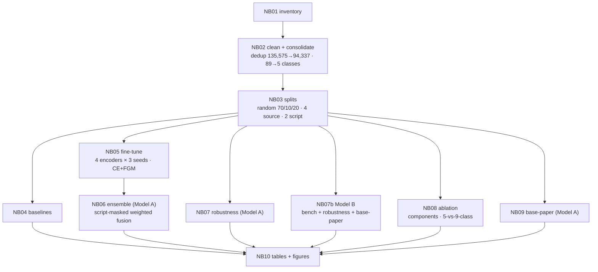
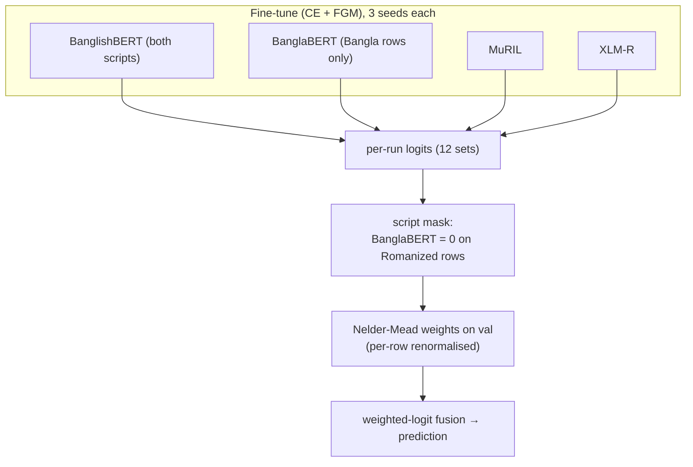
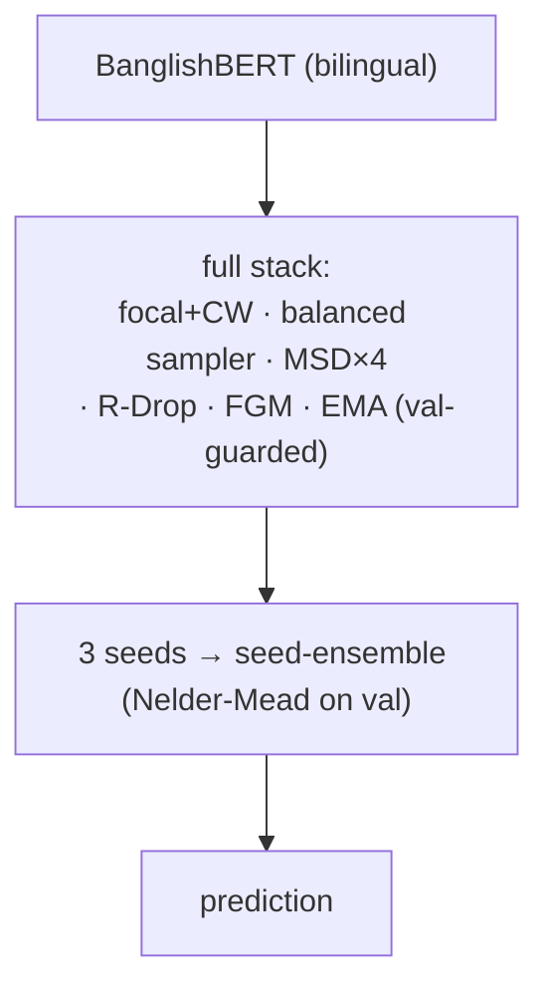

<!-- README.md -->
<h1 align="center">BanglaCyberBench</h1>
<p align="center">
  <b>A Multi-Source, Dual-Script Benchmark and Two Script-Aware Transformer Ensembles<br/>
  for Robust Fine-Grained Bengali Cyberbullying Detection</b>
</p>

<p align="center">
  
  
  
  
  
</p>

---

## Overview

Bengali cyberbullying detection has been studied almost entirely on **single sources**, in **a single
script (Bangla)**, with **coarse labels**, and **without robustness testing**. **BanglaCyberBench**
addresses all four gaps. It provides a **deduplicated, four-source, dual-script** benchmark of
**94,337** unique comments spanning **Bangla script and Romanized Bangla**, consolidated into a clean
**5-class** abuse taxonomy, and it proposes and contrasts **two transformer systems**, each evaluated
**in-domain, across sources, and across scripts**, and benchmarked against the current SOTA stacking
model.

> This repository contains the full pipeline (data → models → ensembles → robustness → paper assets),
> all configuration, and a complete experiment log. See **`experiment_log_final_v2.md`** for the
> end-to-end research narrative and design rationale.

---

## Key contributions

1. **A clean benchmark.** Four public datasets merged, **deduplicated** (135,575 → 94,337), unified to
   one schema, and consolidated from **89 raw label strings → 5 classes** via a documented priority rule.
2. **Dual-script coverage.** ~60% Bangla script, ~40% Romanized Bangla — the only Bengali cyberbullying
   resource we are aware of that evaluates **both scripts**.
3. **Two contrasting proposed systems.**
   - **Model A — Script-Aware Ensemble (main):** four encoders (BanglishBERT, a **Bangla-script
     specialist** BanglaBERT, MuRIL, XLM-R), each fine-tuned with a *minimal* recipe
     (cross-entropy + **FGM** adversarial training), fused by a **script-masked**, validation-optimised
     weighted-logit ensemble.
   - **Model B — Full-Stack BanglishBERT (alternate):** a single bilingual encoder trained with the
     *complete* regularisation stack (focal+CW, balanced sampler, multi-sample dropout, R-Drop, FGM,
     EMA), **seed-ensembled** across three seeds.
4. **A genuine robustness study.** In-domain + **4 source-held-out** + **2 script-held-out** protocols,
   with **dedicated leakage-free training** per held-out config (no checkpoint reuse) and a hard `uid`
   intersection guard.
5. **A like-for-like base-paper comparison** on Hoque & Seddiqui (2025)'s own Facebook-44K, 5-class protocol.

---

## Headline results

Numbers below are **final** for **Model B** (the completed full-stack run). The complete per-model and
main-ensemble (Model A) tables are committed under `outputs/paper/` and detailed in the experiment log.

| Setting | Metric | Model B (full-stack BanglishBERT) |
|---|---|---|
| **In-domain** (20% test, 5-class) | Macro-F1 / Wt-F1 / Acc / MCC / AUROC | **0.8135** / 0.8224 / 0.8222 / 0.7291 / 0.9534 |
| **Base-paper** (Facebook-44K, native 5-class) | Macro-F1 (ours vs base 0.8923) | **0.8670** (Δ −0.0253) |
| **Base-paper — `Threat` class** | F1 (ours vs base 0.7579) | **0.8337** (**+0.0758**) |
| **Robustness** (mean of 6 held-out splits) | Macro-F1 | 0.3653 |

**Take-aways.** In-domain performance is strong; on the base paper's own dataset we are marginally
below on overall Macro-F1 but **improve the hardest, most safety-critical class (`Threat`) by ~7.6
points**; and the robustness study reveals that **cross-script transfer — not in-domain accuracy — is
the open frontier** (script-held-out Macro-F1 falls to 0.16–0.22). That finding is precisely what
motivates Model A's script-aware design.

---

## Repository structure

```
CYBERBULLY_DETECTION_PAPER/
├── data/                       # raw, merged, cleaned, and split CSVs
│   ├── merged/                 #   benchmark_raw.csv
│   ├── processed/              #   benchmark_cleaned.csv (deduplicated, label5)
│   └── splits/                 #   random_{train,val,test}, source_holdout_*, script_holdout_*
├── notebooks/                  # the end-to-end pipeline (run in order)
│   ├── 01_dataset_inventory.ipynb
│   ├── 02_preprocessing_and_consolidation.ipynb
│   ├── 03_data_splits.ipynb
│   ├── 04_baselines.ipynb
│   ├── 05_advanced_finetuning.ipynb         # Model A encoders (CE + FGM)
│   ├── 06_ensemble.ipynb                     # Model A: script-aware weighted fusion
│   ├── 07_robustness.ipynb                    # Model A: source/script held-out
│   ├── 07b_altmethod_master.ipynb            # Model B: bench + robustness + base-paper
│   ├── 08_ablation.ipynb                      # components + 5-vs-9-class taxonomy
│   ├── 09_basepaper_comparison.ipynb         # Model A vs base paper (Facebook-44K)
│   ├── 10_analysis_and_assets.ipynb          # all paper tables & figures
│   └── 11_check_on_less_data.ipynb           # pre-flight methodology sanity gate
├── src/                        # shared modules / utilities
├── outputs/                    # all generated artifacts (see output tree below)
├── paper/                      # manuscript, LaTeX, paper-ready tables & figures
├── other_papers/               # reference PDFs (base paper, related work)
├── experiment_log_final_v2.md  # master research log (motivation → results → limitations)
├── Readme.md
└── .gitignore
```

<details>
<summary><b>outputs/ tree</b></summary>

```
outputs/
├── baselines/baseline_results.csv
├── models_main/                 # NB05: 4 encoders × 3 seeds + per_run_summary.csv
├── ensemble/                    # NB06 (Model A): ensemble_test_metrics.json, predictions, confusion matrix
├── ablation/                    # NB08: component_ablation.csv, taxonomy_ablation.csv
├── robustness/                  # NB07 (Model A): robustness_summary.csv + per-config
├── altmethod/                   # NB07b (Model B): benchmark / robust_* / basepaper / *_summary.json
├── basepaper/comparison.json    # NB09 (Model A) vs base paper
├── fig_label5_distribution.png
├── paper/                       # NB10: table1..6 (.csv/.tex) + figures
└── finalized_outputs/figures/   # curated, renamed figures (01_..06_) used in the paper/log
```
</details>

---

## The benchmark

| Source | Script | Origin | ~Samples (dedup) |
|---|---|---|---:|
| `banth` | Romanized | Kaggle | ~37,334 |
| `facebook_44001` | Bangla | Mendeley | ~43,000 |
| `multilabel_12557` | Bangla | Kaggle | ~9,000 |
| `bd_shs` | Bangla | Mendeley | ~5,000 |
| **Total (unique)** | | | **94,337** |

- **Scripts:** Bangla script **60.4%** (56,989) · Romanized Bangla **39.6%** (37,334).
- **5-class taxonomy:** `none · abusive · sexual · religious · threat`, resolved from compound labels by
  priority **threat > sexual > religious > abusive > none**.
- **Deduplication** is enforced on cleaned text; a hard `uid` intersection assert guarantees no
  train/test overlap in any split (including held-out configs).

> `banth` is the only Romanized source, so `source_holdout_banth` and `script_holdout_romanized` are
> the *same* experiment — reported transparently, never double-counted.

---

## Methods

### Pipeline



### Model A — Script-Aware Ensemble (main)



**Script-aware contract:** BanglaBERT trains/tests on **Bangla rows only**; on Romanized rows it emits
neutral logits and receives **zero ensemble weight**, with the remaining encoders renormalised per row.

### Model B — Full-Stack BanglishBERT (alternate)



The two systems differ on **architecture** (a specialised four-encoder committee vs. one bilingual
encoder) **and recipe** (ablation-driven minimal CE+FGM vs. the full regularisation stack) — the core
comparison the study is built around.

---

## Reproducing the experiments

### Environment
```bash
python -m venv .venv && source .venv/bin/activate        # Python 3.13
pip install torch transformers scikit-learn pandas numpy sentencepiece scipy matplotlib seaborn
# notebooks pin compatible versions in their first cell
```

### Run order
Execute the notebooks in `notebooks/` in numeric order: **01 → 02 → 03 → 04 → 05 → 06 → 07 / 07b → 08 →
09 → 10**. `11_check_on_less_data.ipynb` is an optional pre-flight sanity gate on a small stratified
sample (run it first if you want to validate the methodology before committing GPU time). Hard
dependencies: `05 → 06`, and `10` consumes every other notebook's outputs; `04/07/07b/08/09` are
otherwise independent and can run in parallel.

### Hardware & key configuration
- Trained on a single GPU (≥16 GB; A100/L40S recommended for speed — model choice does not affect
  metrics, only wall-clock).
- Effective batch size **32** (`batch_size=32, grad_accum=1`), `max_length=128`, **8 epochs** with early
  stopping (patience 3), **uniform learning rate** (no layer-wise decay), fp16, seeds `{42, 123, 456}`.
- Primary metric: **Macro-F1** (reported with Weighted-F1, Accuracy, MCC, Macro-AUROC, and per-class F1).

---

## Selected figures

> Figures live under `outputs/finalized_outputs/figures/`. If your committed filenames differ, adjust
> the paths below.

| Figure | Path |
|---|---|
| Class distribution (5-class) | `outputs/finalized_outputs/figures/01_class_distribution.png` |
| Confusion matrix (ensemble, 20% test) | `outputs/finalized_outputs/figures/02_confusion_matrix.png` |
| Per-class F1 | `outputs/finalized_outputs/figures/03_per_class_f1.png` |
| Component ablation | `outputs/finalized_outputs/figures/04_ablation.png` |
| Robustness across held-out splits | `outputs/finalized_outputs/figures/05_robustness.png` |
| Base-paper comparison | `outputs/finalized_outputs/figures/06_basepaper.png` |

---

## Data availability & ethics

The benchmark is assembled from four publicly released datasets (Kaggle / Mendeley); please cite the
original sources (listed in `other_papers/` and the manuscript) and respect their individual licenses.
This resource is intended **solely for research on detecting and mitigating online harm**. It contains
offensive and abusive language by necessity; it must not be used to target, harass, or profile
individuals or groups.

---

## Citation

If you use BanglaCyberBench, please cite:

```bibtex
@misc{alam2026banglacyberbench,
  title        = {BanglaCyberBench: A Multi-Source, Dual-Script Benchmark and Script-Aware
                  Transformer Ensembles for Robust Fine-Grained Bengali Cyberbullying Detection},
  author       = {Alam, Parvez and Rahman, Md. Naim Parvez,Khandoker Sefayet Alam, A. F. M. Minhazur},
  year         = {2026},
  note         = {Preprint},
  howpublished = {\url{https://github.com/Sefayet-Alam/CyberBully_Detection_Paper}}
}
```

Please also cite the base paper our protocol compares against:
Hoque, M. & Seddiqui, M. H. (2025). *Transformer-stacking for Bengali cyberbullying detection.*
Frontiers in Artificial Intelligence.

---

## Authors & contact

**Sefayet Alam** — sefayetalam14@gmail.com · **Md. Naim Parvez**

**A. F. M. Minhazur Rahman** (supervisor) — Assistant Professor, Dept. of Computer Science &
Engineering, Rajshahi University of Engineering & Technology (RUET) ·
afm.minhazur@cse.ruet.ac.bd · [profile](https://www.ruet.ac.bd/mrsaurov)

---

## License

Code released under the **MIT License**; the assembled benchmark and annotations under
**CC-BY-4.0**, subject to the licenses of the four original source datasets. See `LICENSE` (add before
public release).