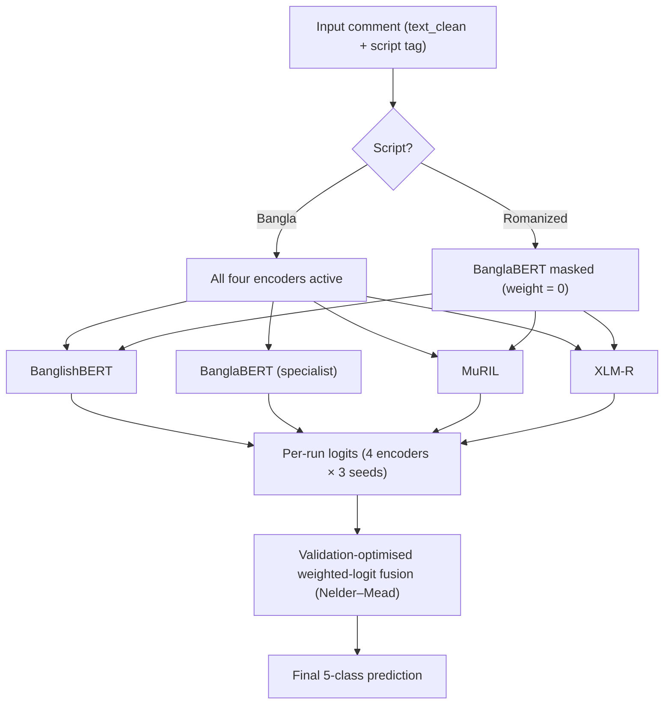

<!-- README.md -->

<h1 align="center">BanglaCyberBench</h1>

<p align="center">
  <b>A Dual-Script Benchmark and a Script-Aware Ensemble<br/>
  for Bengali Cyberbullying Detection</b>
</p>

<p align="center">
  
  
  
  
  
  
</p>

---

## Overview

**BanglaCyberBench** is a deduplicated, multi-source, dual-script benchmark for fine-grained Bengali cyberbullying detection. It merges four public Bengali abuse-detection datasets into one corpus of **94,323 unique comments** (from 135,575 raw rows), covering both **Bangla script** and **Romanized Bangla** (*Banglish*).

Prior Bengali cyberbullying work shares three limitations that this project takes up directly:

1. Datasets are almost always **single-source**, so models learn one platform's quirks rather than the phenomenon.
2. Evaluation is almost always **Bangla-script only**, leaving the ubiquitous Romanized script untested.
3. Evaluation almost always stops at a **random in-domain split**, so nothing measures transfer under distribution shift.

The repository contains the full research pipeline:

```text
dataset inventory → EDA / preprocessing → label consolidation → splits
→ classical + transformer baselines → proposed script-aware ensemble
→ component / taxonomy / script-mask ablations → cross-source robustness
→ base-paper comparison → statistical analysis → paper-ready figures & tables
```

The proposed system is a **script-aware weighted-logit transformer ensemble** over BanglishBERT, BanglaBERT, MuRIL, and XLM-R. On the official 20% in-domain test split it reaches:

> **Macro-F1 0.8225** &nbsp;·&nbsp; **Weighted-F1 0.8332** &nbsp;·&nbsp; **Accuracy 0.8339** &nbsp;·&nbsp; **MCC 0.7452** &nbsp;·&nbsp; **Macro-AUROC 0.9626**
>
> 95% bootstrap CI on Macro-F1: **[0.8151, 0.8298]** (B = 2,000).

---

## Key Contributions

1. **BanglaCyberBench benchmark** — four public sources unified, deduplicated to **94,323** unique comments, dual-script (Bangla 60.4% / Romanized 39.6%), under one schema: `text`, `text_clean`, `label_binary`, `label_type`, `label5`, `source`, `script`, `uid`. A hard `uid` intersection assertion guarantees no comment leaks across splits.

2. **Documented 5-class taxonomy** — 89 raw label strings folded into `none`, `abusive`, `sexual`, `religious`, `threat` by an explicit priority rule:

   ```text
   threat > sexual > religious > abusive > none
   ```

   Label quality was verified with a two-stage check: an LLM screened every consolidated label against its text, and the flagged/borderline cases were manually adjudicated by the authors.

3. **Script-aware ensemble with a lean, ablation-chosen recipe** — each of the four encoders is fine-tuned with **cross-entropy + FGM adversarial training** (3 seeds each); the twelve logit vectors are fused by a validation-optimised weighted-logit rule. BanglaBERT is a **Bangla-script specialist**, masked off on Romanized rows.

4. **Cross-source robustness study** — each of the three Bangla-script sources is held out in turn (train on the other two, test on the held-out one), with error bars over three seeds. The Romanized source is treated separately as a coupled source-plus-script shift.

5. **Same-protocol base-paper comparison** — retrained under Hoque et al.'s Facebook-44K, native 5-class protocol; competitive overall and clearly stronger on the safety-critical `Threat` class.

6. **Statistically grounded reporting** — bootstrap 95% confidence intervals on every headline and per-class metric; benchmark, splits, and code released.

---

## Final Benchmark Summary

### Sources (after deduplication)

| Source | Script | Origin | Final samples |
|---|---|---|---:|
| `facebook_44001` | Bangla | Mendeley | 43,078 |
| `banth` | Romanized | Kaggle | 37,334 |
| `multilabel_12557` | Bangla | Kaggle | 8,882 |
| `bd_shs` | Bangla | Mendeley | 5,029 |
| **Total** | — | — | **94,323** |

### Script Distribution

| Script | Samples | Share |
|---|---:|---:|
| Bangla script | 56,989 | 60.4% |
| Romanized Bangla | 37,334 | 39.6% |
| **Total** | **94,323** | **100.0%** |

### Class Distribution

| Class | Samples | Share |
|---|---:|---:|
| `none` | 47,312 | 50.2% |
| `abusive` | 24,963 | 26.5% |
| `sexual` | 10,822 | 11.5% |
| `religious` | 8,032 | 8.5% |
| `threat` | 3,194 | 3.4% |
| **Total** | **94,323** | **100.0%** |

The corpus is strongly imbalanced (≈14.8:1 between `none` and `threat`), which is why **Macro-F1** is the primary metric.

---

## Splits

Main in-domain setting: stratified **70/10/20** split on `label5`.

| Split | Samples |
|---|---:|
| Train | 66,026 |
| Validation | 9,432 |
| Test | 18,865 |
| **Total** | **94,323** |

Robustness protocol:

| Protocol | Description |
|---|---|
| Source-held-out (×3) | Train on two Bangla-script sources, test on the third; `banth` excluded from the pool |

Every configuration re-runs a hard `uid` intersection assertion, so cross-split leakage is impossible by construction.

---

## Proposed Model



### Encoder Roles

| Encoder | Hugging Face ID | Role |
|---|---|---|
| BanglishBERT | `csebuetnlp/banglishbert` | Bilingual Bangla + Romanized workhorse |
| BanglaBERT | `csebuetnlp/banglabert` | Bangla-script specialist (masked off Romanized rows) |
| MuRIL | `google/muril-base-cased` | Multilingual / transliteration-aware |
| XLM-R | `xlm-roberta-base` | Multilingual baseline |

### Training Recipe

| Component | Setting |
|---|---|
| Loss | Label-smoothed cross-entropy (s = 0.03) |
| Adversarial training | FGM (ε = 1.0) |
| Optimiser | AdamW, encoder LR 2e-5 / head LR 8e-5, no decay |
| Seeds | 42, 123, 456 |
| Max length | 128 |
| Precision | fp16 mixed precision |
| Hardware | 1 × NVIDIA A6000 (48 GB), 32 GB RAM |
| Fusion | Validation-optimised weighted-logit (Nelder–Mead) |
| Primary metric | Macro-F1 |

---

## Main Results

### Official 20% In-Domain Test (n = 18,865)

| System | Macro-F1 | Weighted-F1 | Accuracy | MCC | Macro-AUROC |
|---|---:|---:|---:|---:|---:|
| Best non-transformer baseline | 0.7674 | 0.7889 | 0.7933 | 0.6788 | 0.9418 |
| **Proposed model** | **0.8225** | **0.8332** | **0.8339** | **0.7452** | **0.9626** |

Bootstrap 95% CIs: Macro-F1 [0.8151, 0.8298] · Weighted-F1 [0.8277, 0.8384] · Accuracy [0.8285, 0.8392] · MCC [0.7369, 0.7530].

### Per-Class F1 (with 95% CI)

| Class | Precision | Recall | F1 | 95% CI | Support |
|---|---:|---:|---:|---|---:|
| `religious` | 0.9221 | 0.8848 | 0.9031 | [0.8924, 0.9143] | 1,606 |
| `none` | 0.8622 | 0.8925 | 0.8771 | [0.8719, 0.8819] | 9,463 |
| `sexual` | 0.8359 | 0.8120 | 0.8238 | [0.8107, 0.8356] | 2,165 |
| `threat` | 0.7878 | 0.7508 | 0.7689 | [0.7429, 0.7951] | 638 |
| `abusive` | 0.7532 | 0.7266 | 0.7397 | [0.7301, 0.7486] | 4,993 |

### Confusion Matrix (20% test)

| True \ Predicted | abusive | none | religious | sexual | threat |
|---|---:|---:|---:|---:|---:|
| abusive | 3,628 | 1,081 | 28 | 195 | 61 |
| none | 856 | 8,446 | 45 | 91 | 25 |
| religious | 60 | 78 | 1,421 | 26 | 21 |
| sexual | 225 | 143 | 17 | 1,758 | 22 |
| threat | 48 | 48 | 30 | 33 | 479 |

Errors concentrate on the `abusive` ↔ `none` boundary — an intent-level overlap, not a data-scarcity problem.

---

## Ablations

### Component Ablation (BanglishBERT, 3 seeds, mean ± std)

| Configuration | Macro-F1 | Δ vs CE |
|---|---:|---:|
| CE only (reference) | 0.7961 ± 0.0022 | +0.0000 |
| **+ FGM** | **0.8071 ± 0.0009** | **+0.0110** |
| + focal + class weights | 0.8055 ± 0.0012 | +0.0094 |
| + balanced sampler | 0.7995 ± 0.0026 | +0.0034 |
| + multi-sample dropout | 0.8068 ± 0.0014 | +0.0107 |
| + R-Drop | 0.8083 ± 0.0006 | +0.0123 |
| + EMA | 0.8093 ± 0.0004 | +0.0132 |
| Full stack (all on) | 0.8042 ± 0.0019 | +0.0081 |

FGM is the decisive gain (≈5× the seed noise). EMA/R-Drop add small further gains that the ensemble's seed-averaging already captures; the balanced sampler and full stack regress. The proposed model fine-tunes each backbone with **CE + FGM** and stops there.

### Taxonomy Ablation

| Taxonomy | Macro-F1 | Weighted-F1 |
|---|---:|---:|
| 5-class (headline) | 0.8073 | 0.8203 |
| 9-class (ablation) | 0.6140 | 0.8020 |

Macro-F1 crashes under 9 classes while Weighted-F1 barely moves — the finer taxonomy is not learnable at this data scale.

### Script Mask (Romanized subset)

| Setting | Romanized Macro-F1 |
|---|---:|
| No script mask (all backbones vote) | 0.4568 |
| **Script-aware mask (proposed)** | **0.4774** |

Masking the Bangla-script specialist off Romanized comments lifts Romanized Macro-F1 by +0.0206. The absolute level is low because Romanized is the minority, data-poor script — the mask makes it measurably less so.

---

## Cross-Source Robustness (3 Bangla-script hold-outs, 4 encoders, 3 seeds)

| Held-out source | Test samples | Macro-F1 | Weighted-F1 | Accuracy | MCC | Macro-AUROC |
|---|---:|---:|---:|---:|---:|---:|
| Facebook-44K | 43,078 | 0.5850 ± 0.0075 | 0.6294 | 0.6419 | 0.5291 | 0.8736 |
| Multilabel-12.5K | 8,882 | 0.5601 ± 0.0123 | 0.5594 | 0.5911 | 0.4515 | 0.8657 |
| BD-SHS | 5,029 | 0.4612 ± 0.0039 | 0.5793 | 0.5531 | 0.4088 | 0.8314 |

In-domain reference Macro-F1 = 0.8225. Transfer to an unseen source costs **24–36 Macro-F1 points**; AUROC stays high (0.83–0.87), so the ranking survives the shift but the decision threshold no longer fits the shifted class balance. This is the study's central message: in-domain accuracy overstates cross-source readiness.

> **Note.** The `banth` (Romanized) hold-out is deliberately excluded from the source-shift analysis because it changes source *and* script at once; its number cannot be attributed to either factor alone. Cross-script transfer is treated as an open problem, not a solved result.

---

## Base-Paper Comparison (Facebook-44K, native 5-class protocol)

Separate protocol — not comparable to the merged-benchmark numbers above.

| System | Macro-F1 | Weighted-F1 | Accuracy | MCC | Macro-AUROC |
|---|---:|---:|---:|---:|---:|
| Base paper (Hoque et al., 2025) | 0.8923 | — | — | — | — |
| **Proposed model** | 0.8679 | 0.8736 | 0.8737 | 0.8314 | 0.9747 |

### Per-Class F1

| Class | Base paper | Proposed model | Δ |
|---|---:|---:|---:|
| Not Bully | 0.9151 | 0.8891 | −0.0260 |
| Religious | 0.9374 | 0.9302 | −0.0072 |
| Sexual | 0.8845 | 0.8720 | −0.0125 |
| Troll | 0.8446 | 0.8192 | −0.0254 |
| **Threat** | 0.7579 | **0.8292** | **+0.0713** |

The proposed model trades a little on the easy classes for a **+7.1-point gain on `Threat`**, the class a moderator can least afford to miss — with four backbones against the base paper's stacked three.

---

## Repository Structure

```text
BanglaCyberBench/
├── data/
│   ├── merged/
│   ├── processed/            # benchmark_cleaned.csv (master, one row per comment)
│   └── splits/               # random_{train,val,test}.csv + source_holdout_bangla_only/
│
├── notebooks/
│   ├── 01_dataset_inventory.ipynb
│   ├── 02_preprocessing_and_consolidation.ipynb
│   ├── 03_data_splits.ipynb
│   ├── 04_baselines.ipynb
│   ├── 05_advanced_finetuning.ipynb
│   ├── 06_ensemble.ipynb
│   ├── 07_robustness.ipynb
│   ├── 08_ablation_upd.ipynb
│   ├── 09_basepaper_comparison.ipynb
│   ├── 10_analysis_and_assets.ipynb
│   └── 12_paper_asset_creation.ipynb
│
├── outputs/
│   ├── baselines/
│   ├── models_main/
│   ├── ensemble/
│   ├── robustness/
│   ├── ablation/
│   ├── basepaper/
│   └── paper_q1/
│       ├── figures/
│       └── tables/
│
├── paper/                    # main.tex, references.bib, figures/
├── experiment_logs_v3.md
├── README.md
└── LICENSE
```

---

## Key Output Files

| File | Description |
|---|---|
| `outputs/ensemble/ensemble_test_metrics.json` | Final proposed-model in-domain test metrics |
| `outputs/ensemble/test_pred.npy`, `test_proba.npy` | Per-example predictions and probabilities |
| `outputs/models_main/per_run_summary.csv` | Per-backbone, per-seed transformer results |
| `outputs/robustness/robustness_summary.csv` | Source-held-out robustness (mean ± std) |
| `outputs/robustness/robustness_perseed.csv` | Per-seed robustness rows |
| `outputs/ablation/component_ablation.csv` | Component ablation (CE-only reference) |
| `outputs/ablation/taxonomy_ablation.csv` | 5-class vs 9-class ablation |
| `outputs/paper_q1/figures/` · `tables/` | Paper-ready figures and LaTeX tables |

---

## Reproducing the Pipeline

### Environment

```bash
python -m venv .venv
source .venv/bin/activate       # Windows: .\.venv\Scripts\Activate.ps1
pip install torch transformers scikit-learn pandas numpy scipy matplotlib seaborn sentencepiece accelerate
```

Experiments were run on a single **NVIDIA A6000 (48 GB)** with fp16 mixed precision.

### Run Order

```text
01_dataset_inventory.ipynb
02_preprocessing_and_consolidation.ipynb
03_data_splits.ipynb
04_baselines.ipynb
05_advanced_finetuning.ipynb
06_ensemble.ipynb
07_robustness.ipynb            # 3 Bangla-script source hold-outs (banth excluded)
08_ablation_upd.ipynb          # CE-only reference + component/taxonomy/script-mask
09_basepaper_comparison.ipynb
12_paper_asset_creation.ipynb  # writes all paper_q1 figures & tables
```

`07_robustness.ipynb` and `08_ablation_upd.ipynb` are standalone: they build their own splits from `data/processed/benchmark_cleaned.csv` and write directly into `outputs/paper_q1/`. Set the `PROJECT_ROOT` (and, if needed, `MASTER_DATASET`) environment variable if your tree differs from the default.

---

## Notes on Evaluation

- **Macro-F1** is primary because the corpus is imbalanced and the rare classes are the safety-critical ones.
- The proposed-model headline uses the 20% in-domain test set (**18,865** comments).
- The Facebook-44K base-paper comparison is a **separate protocol** and must not be mixed with the merged-benchmark result.
- Robustness covers only the **three Bangla-script** sources; `banth` (Romanized) is excluded from source-shift analysis because it couples source and script shift.
- Cross-script transfer to Romanized Bangla remains the main open challenge.

---

## Data Availability and Ethics

The benchmark is assembled from public datasets released through Kaggle and Mendeley. Please cite the original sources and respect their individual licenses. To comply with the most restrictive source terms, the release provides preprocessing/consolidation/split code, per-source download instructions, and `uid`-level split manifests so the benchmark can be rebuilt exactly; raw comment text is redistributed only where the source license permits.

This repository is for research on detecting and mitigating online harm. The data contains offensive, abusive, and harmful language by necessity, and must not be used to target, profile, harass, or discriminate against individuals or groups.

---

## Citation

```bibtex
@misc{alam2026banglacyberbench,
  title        = {BanglaCyberBench: A Dual-Script Benchmark and a Script-Aware Ensemble for Bengali Cyberbullying Detection},
  author       = {Alam, Sefayet and Parvez, Naim and Rahman, A. F. M. Minhazur},
  year         = {2026},
  note         = {Preprint},
  howpublished = {\url{https://github.com/Sefayet-Alam/BanglaCyberBench}}
}
```

Base paper used for comparison:

```bibtex
@article{hoque2025transformerstacking,
  title   = {Advancing cyberbullying detection in low-resource languages: a transformer-stacking framework for Bengali},
  author  = {Hoque, Md. Nesarul and Nath, Rudra Pratap Deb and Chy, Abu Nowshed and Ghose, Debasish and Seddiqui, Md. Hanif},
  journal = {Frontiers in Artificial Intelligence},
  volume  = {8},
  year    = {2025},
  doi     = {10.3389/frai.2025.1679962}
}
```

---

## Authors and Contact

- **Sefayet Alam** — `sefayetalam14@gmail.com`
- **Md. Naim Parvez**
- **A. F. M. Minhazur Rahman** — Department of Computer Science and Engineering, Rajshahi University of Engineering & Technology (RUET)

---

## License

Code is released for research use. Dataset redistribution is subject to the licenses of the original source datasets. See `LICENSE`.