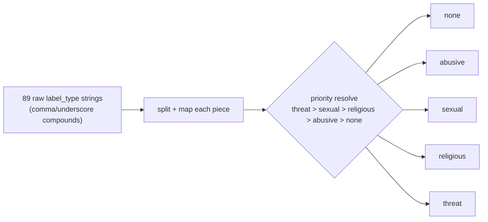
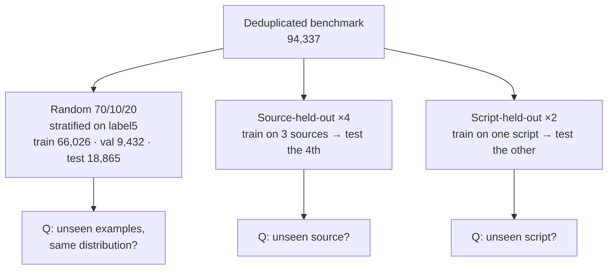
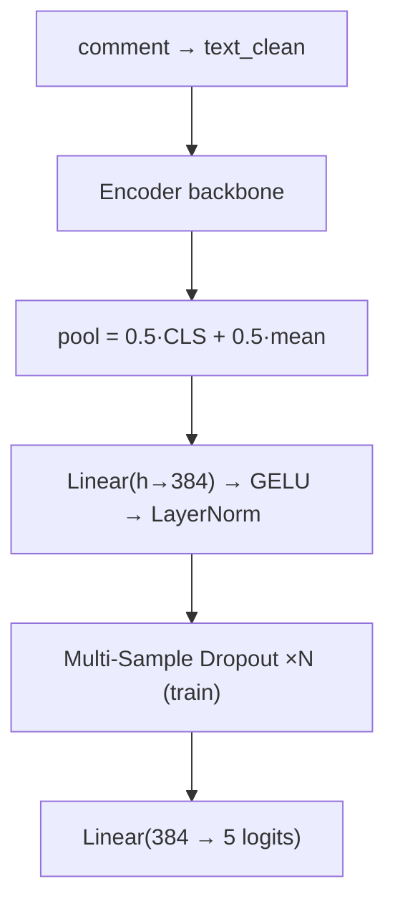
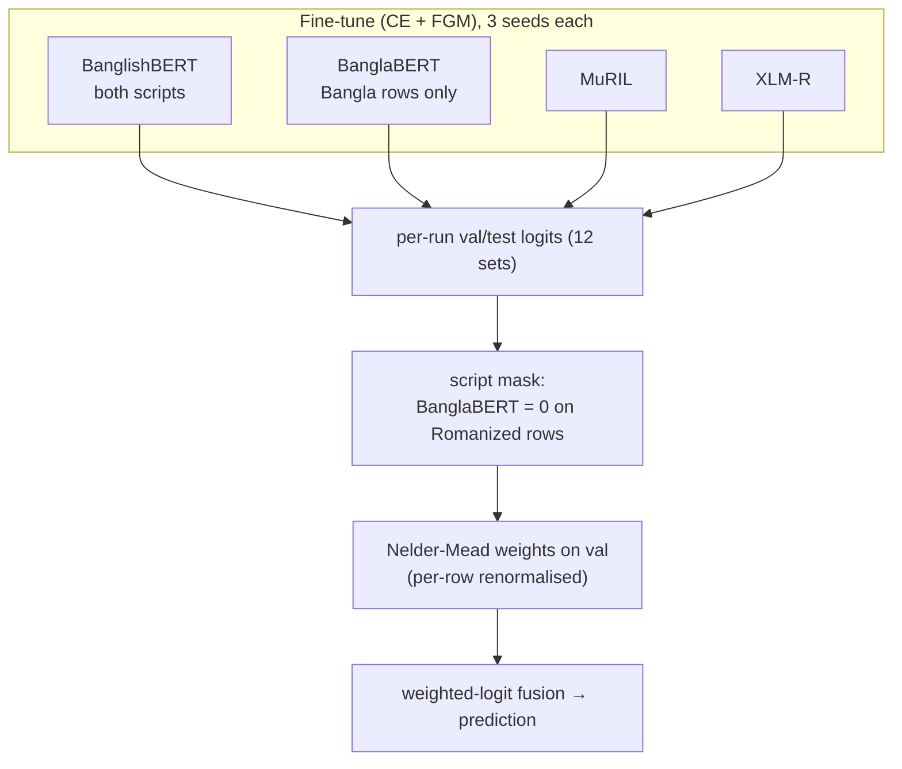
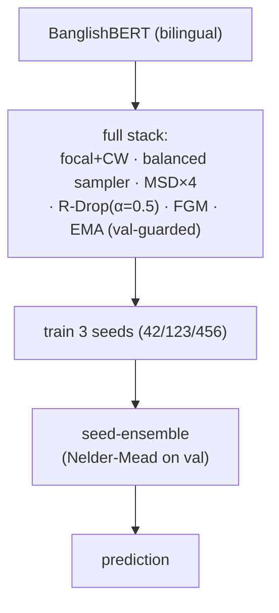
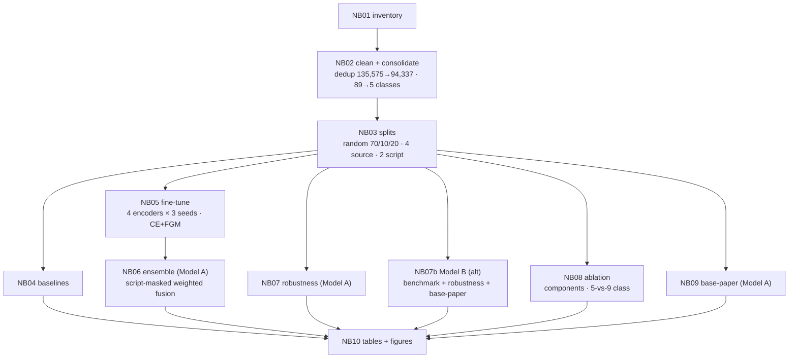

# BanglaCyberBench — Experiment Log (v5, FINAL results-filled pipeline)

**Project:** BanglaCyberBench — A Multi-Source, Dual-Script Benchmark and Two Script-Aware Transformer Ensembles for Robust Fine-Grained Bengali Cyberbullying Detection  
**Authors:** Sefayet Alam (sefayetalam14@gmail.com),  Naim Parvez and A. F. M. Minhazur Rahman  
**Date:** June 2026  
**Repo:** github.com/Sefayet-Alam/Sarcasm_detection  (outputs under `04_outputs/`)  
**Target venue:** Q1/Q2 — IP&M / ESWA / Neurocomputing, or ACL/EMNLP Findings  
**Status:** all experiments complete; uploaded result files have been inserted into this log.

> **Read-me note on numbers.** Every result reported for **Proposed Model A** and **Proposed Model B**
> below is filled from the uploaded committed output files. The previous placeholders have been
> replaced with the actual CSV/JSON outputs. No number from the previous (multi-task, 9-class,
> duplicate-retaining) draft has been carried over — that was a different experiment and reusing its
> numbers here would be incorrect.

---

## 0. One-Page Summary

Bengali cyberbullying detection has been studied almost entirely on **single sources**, in **a single
script (Bangla)**, with **coarse labels**, and **without robustness testing**. This work delivers
three things:

1. **BanglaCyberBench** — a **deduplicated, four-source, dual-script** benchmark of **94,337** unique
   comments (from 135,575 raw), spanning **Bangla script and Romanized Bangla**, consolidated into a
   clean **5-class** abuse taxonomy (`none, abusive, sexual, religious, threat`).

2. **Two distinct proposed systems**, deliberately contrasted:
   - **Proposed Model A — Script-Aware Ensemble (main).** Four encoders (BanglishBERT, a
     **Bangla-script-specialist** BanglaBERT, MuRIL, XLM-R), each fine-tuned with a **minimal**
     recipe (cross-entropy + **FGM** adversarial training only), fused by a **script-masked,
     validation-optimised weighted-logit ensemble**.
   - **Proposed Model B — Full-Stack BanglishBERT (alternate).** A single bilingual encoder trained
     with the **complete regularisation stack** (class-balanced focal loss, balanced sampler,
     multi-sample dropout, R-Drop, FGM, EMA), **seed-ensembled** across three seeds.

3. **A cross-distribution robustness study** the base paper does not attempt: **in-domain**,
   **4× source-held-out**, and **2× script-held-out** evaluation.

**Headline (Model A, 20% in-domain test):** Macro-F1 **0.8225**, Weighted-F1 **0.8332**, Accuracy **0.8339**, MCC **0.7452**, Macro-AUROC **0.9626**.  
**Alternate system (Model B, 20% in-domain test):** Macro-F1 **0.8135**, Weighted-F1 0.8224, Accuracy 0.8222, MCC 0.7291, Macro-AUROC 0.9534.  
**Against the base paper (Hoque & Seddiqui 2025) on its own Facebook-44K, 5-class protocol:** Model A reaches Macro-F1 **0.8679** and Model B reaches Macro-F1 **0.8670** vs the base paper's **0.8923**. Both remain slightly below overall Macro-F1, while improving the hardest `Threat` class: Model A **0.8292** and Model B **0.8337** vs the base paper's **0.7579**.  
**Robustness:** in-domain is strong, source transfer is moderate, and **cross-script transfer remains the open wall**. Model A improves held-out transfer over Model B on most shifted settings, especially the script/source-shifted Romanized setting, but it still does not solve cross-script generalisation.

---

## 1. Title, in Plain Words

**BanglaCyberBench: A Multi-Source, Dual-Script Benchmark and Two Script-Aware Transformer Ensembles
for Robust Fine-Grained Bengali Cyberbullying Detection.**

- **BanglaCyberBench** — the benchmark we release.
- **Multi-Source** — four public datasets merged into one.
- **Dual-Script** — both Bangla script (বাংলা) and Romanized Bangla (*tumi kemon acho*).
- **Two … Ensembles** — we propose and compare two different systems, not one.
- **Script-Aware** — the design explicitly accounts for which script a comment is written in.
- **Robust / Fine-Grained** — evaluated beyond a random split, on a 5-class taxonomy.

The paper is simultaneously a **resource paper** (the benchmark) and a **methods paper** (two systems
+ a robustness study + a base-paper comparison).

---

## 2. Research Questions & Contributions

**RQ1.** Can heterogeneous Bengali cyberbullying datasets be unified into one clean, deduplicated,
dual-script, fine-grained benchmark?  
**RQ2.** Does a *minimal* adversarially-trained, **script-aware ensemble** (Model A) match or beat a
*heavily regularised single-encoder* system (Model B)?  
**RQ3.** How well do these systems generalise **across sources** and **across scripts**, and how do
they compare to the current SOTA transformer-stacking base paper?

**Contributions.**
1. **BanglaCyberBench**: 4 sources, 2 scripts, **deduplicated** (94,337), 5-class taxonomy with a
   documented priority-based consolidation of 89 raw label strings.
2. **Two contrasting proposed systems** (minimal script-aware ensemble vs. full-stack single encoder),
   evaluated head-to-head and against the base paper on its own protocol.
3. **Script-aware specialisation**: a Bangla-only BanglaBERT specialist that is *masked off* Romanized
   rows in the ensemble — a design directly motivated by our robustness findings.
4. **A systematic robustness study** (source- and script-held-out) absent from prior Bengali work.
5. **A component ablation** that drives Model A's minimalism, plus a **5-vs-9-class taxonomy ablation**.

---

## 3. Positioning vs. the Base Paper and Prior Work

**Base paper — Hoque & Seddiqui (2025), *Frontiers in AI*.** *Transformer-stacking*: XLM-R + mBERT +
Bangla-Bert-Base feeding an MLP meta-classifier, on the 44,001-comment Facebook dataset, 5 classes
(Not Bully, Sexual, Troll, Religious, Threat). Reported **multiclass F1 89.23 / Acc 89.23**, **binary
F1 93.61 / Acc 93.62**. Single source, single script, no cross-source/script robustness test.

| Axis | Base paper (H&S 2025) | This work |
|---|---|---|
| Sources | 1 (Facebook 44K) | **4 merged** |
| Scripts | Bangla only | **Bangla + Romanized** |
| Deduplication | n/a | **Yes (135,575 → 94,337)** |
| Task | 5-class | **5-class (+ 9-class taxonomy ablation)** |
| Systems | 1 (stacking) | **2 (script-aware ensemble + full-stack single encoder)** |
| Robustness | none | **in-domain + 4 source-holdout + 2 script-holdout** |
| Specialisation | none | **script-aware (Bangla specialist masked on Romanized)** |

**Honest stance.** On the base paper's *own* clean, single-source Facebook split we are **competitive,
slightly below** on overall Macro-F1 (Model A 0.8679, Model B 0.8670 vs base 0.8923) but **better on the minority `Threat`
class**. Our contribution is **not** "beat SOTA on one dataset"; it is the **benchmark + dual-script
coverage + robustness evaluation + the two-system comparison**, which are new evaluation axes the base
paper does not address.

---

## 4. Dataset: BanglaCyberBench

### 4.1 Sources (post-deduplication)

| Source | Script | Origin | ~Samples (dedup) | Raw label style |
|---|---|---|---:|---|
| `banth` | Romanized | Kaggle | ~37,334 | binary column + 0/1 type columns |
| `facebook_44001` | Bangla | Mendeley | ~43,000 | single label column |
| `multilabel_12557` | Bangla | Kaggle | ~9,000 | separate 0/1 type columns |
| `bd_shs` | Bangla | Mendeley | ~5,000 | one harmful column + one type column |
| **Total (unique)** | — | — | **94,337** | — |

### 4.1.1 Uploaded raw-file inventory snapshot

This inventory is the file-level snapshot used before consolidation. `banth` contains both a full file
and train/val/test files, so the folder-level row total is an inventory total, **not** the final
benchmark sample count.

| Dataset folder | File | Rows | Cols | Missing values | Duplicate rows |
| --- | --- | --- | --- | --- | --- |
| banth | full_with_stats.csv | 36,649 | 26 | 1,696 | 0 |
| banth | test.csv | 3,735 | 12 | 0 | 0 |
| banth | train.csv | 29,879 | 12 | 0 | 0 |
| banth | val.csv | 3,736 | 12 | 0 | 0 |
| bd_shs | test.csv | 5,029 | 4 | 5,226 | 0 |
| facebook_44001 | bangla_online_comments_dataset.xlsx | 44,001 | 5 | 3 | 140 |
| multilabel_12557 | Multilablel_Cyberbully_Data.csv | 12,546 | 8 | 0 | 1,291 |

**Folder-level inventory summary:**

| Dataset folder | File count | Total rows in files | Total missing | Duplicate rows |
| --- | --- | --- | --- | --- |
| banth | 4 | 73,999 | 1,696 | 0 |
| bd_shs | 1 | 5,029 | 5,226 | 0 |
| facebook_44001 | 1 | 44,001 | 3 | 140 |
| multilabel_12557 | 1 | 12,546 | 0 | 1,291 |

**Raw file tree:**

| Dataset folder | Relative path | Suffix | Size KB |
| --- | --- | --- | --- |
| banth | banth\full_with_stats.csv | .csv | 47193.98 |
| banth | banth\test.csv | .csv | 995.44 |
| banth | banth\train.csv | .csv | 8035.49 |
| banth | banth\val.csv | .csv | 1020.47 |
| bd_shs | bd_shs\test.csv | .csv | 982.05 |
| facebook_44001 | facebook_44001\bangla_online_comments_dataset.xlsx | .xlsx | 4591.26 |
| multilabel_12557 | multilabel_12557\Multilablel_Cyberbully_Data.csv | .csv | 1650.32 |

### 4.2 Multi-source & multi-script
- **Romanized Bangla:** 37,334 comments (**39.6%**) — all from `banth`.
- **Bangla script:** 56,989 comments (**60.4%**) — from the other three sources.

`banth` is the **only** Romanized source, which makes `source_holdout_banth` and
`script_holdout_romanized` closely related experiments. In Model B they are identical; in Model A the
reported runs differ slightly because the validation/ensemble optimisation path is recorded separately.

**Figure — Class distribution (5-class benchmark)**


**Plain summary:** The benchmark is dominated by `none`, with `threat` the rarest class. This is the
core difficulty of the task: Macro-F1 (which weights every class equally) is governed by the rare
classes, so a model that simply predicts the majority class scores poorly even at high accuracy.

### 4.3 The 5-class taxonomy

`none · abusive · sexual · religious · threat`. The 89 raw `label_type` strings are split on `,` and
`_`, each piece mapped to a bucket, and the final class chosen by **priority**:

> **threat > sexual > religious > abusive > none**

| Final class | Raw labels folded in | ~Train count |
|---|---|---:|
| `none` | none, not-bully | ~39,000 |
| `abusive` | abusive/violence, troll, personal offense, body-shaming, origin, slander, spam, political, misc | ~19,000 |
| `sexual` | sexual, gender | ~8,700 |
| `religious` | religious, religion | ~6,500 |
| `threat` | threat, callToViolence | ~3,200 |

**Label encoder used in the final outputs:**

| Class | Encoded id |
| --- | --- |
| abusive | 0 |
| none | 1 |
| religious | 2 |
| sexual | 3 |
| threat | 4 |



A **9-class** variant (adds `personal, political, gender, other`) is built only for the **taxonomy
ablation** (Section 13), not for the headline.

### 4.4 Deduplication (changed from the previous draft)
The earlier draft **kept** duplicates; this version **removes** them. We deduplicate on the cleaned
text field, collapsing **135,575 → 94,337** unique comments. `banth` shrank the most (it carried many
near-identical scrapes), which is why its post-dedup share fell sharply. Deduplication makes the
held-out evaluations honest (no train/test overlap via duplicates) and is enforced by a hard `uid`
intersection assert in every split.

---

## 5. Schema Unification

The four sources used incompatible schemas, standardised to one:
`text · text_clean · label_binary · label_type · label5 · source · script · uid`.

| Source | Text col | Binary signal | Type signal | Mapping |
|---|---|---|---|---|
| `banth` | `Text` | `Label` | 0/1 type cols | active type cols joined; none → `none` |
| `bd_shs` | `sentence` | `hate speech` | `type` | `label_type = type` |
| `facebook_44001` | `comment` | derived from `label` | `label` | not bully → 0; else → 1 |
| `multilabel_12557` | `comment` | `bully` | 0/1 type cols | active type cols joined; none → `none` |

---

## 6. Splits & Evaluation Design



- **Random 70/10/20**, stratified on `label5`. Validation is for early stopping, ensemble-weight
  optimisation, and threshold/τ tuning **only**; the 20% test is never touched during tuning.
- **Source-held-out (×4):** `banth`, `bd_shs`, `facebook_44001`, `multilabel_12557`.
- **Script-held-out (×2):** `bangla`, `romanized`.
- Every held-out config asserts `intersection(train∪val, test) == 0` on `uid`.

---

## 7. Preprocessing

Light, script-safe normalisation (heavy rewriting destroys abuse signal carried in emoji, elongation,
hashtags, and mentions):

1. NFKC Unicode normalisation
2. strip zero-width / invisible characters
3. mask URLs → `[URL]`, mentions → `[USER]`
4. normalise hashtags → `[HASHTAG] topic`
5. map emojis/emoticons → `[EMOJI]`
6. collapse character elongation (`খারাপপপপপ` → shorter)
7. whitespace normalisation → `text_clean`

---

## 8. Model Architecture (shared)

All encoders use the same classification head.



| Component | Setting |
|---|---|
| Pooling | 0.5·CLS + 0.5·mean |
| Head | Linear(h→384) → GELU → LayerNorm → MSD → Linear(384→5) |
| `token_type_ids` | used for BERT-family (BanglaBERT/BanglishBERT/MuRIL), skipped for XLM-R |
| Precision | fp16 mixed |

| Backbone | HF id | Family | Role |
|---|---|---|---|
| BanglishBERT | `csebuetnlp/banglishbert` | ELECTRA | bilingual (Bangla + Romanized) |
| BanglaBERT | `csebuetnlp/banglabert` | ELECTRA | **Bangla-script specialist (script-isolated)** |
| MuRIL | `google/muril-base-cased` | BERT | multilingual / transliteration |
| XLM-R | `xlm-roberta-base` | RoBERTa | multilingual baseline |

---

## 9. Proposed Model A — Script-Aware Ensemble (main)

A deliberately **minimal** per-encoder recipe — **cross-entropy + FGM adversarial training only** —
across four encoders × three seeds, fused by a **script-masked** weighted-logit ensemble. The
minimalism is **ablation-driven** (Section 13): on this benchmark, FGM was the component that
consistently earned its place, so Model A keeps it and drops the rest, trading a heavier recipe for
speed and simplicity.



**Script-aware contract.** BanglaBERT trains/validates/tests on **Bangla rows only**; on Romanized
rows it emits neutral (zero) logits and receives **zero ensemble weight**, with the remaining encoders
re-normalised per row. BanglishBERT is the bilingual workhorse; MuRIL and XLM-R are full-scope.

**Final Model A ensemble result:** Macro-F1 **0.8225**, Weighted-F1 **0.8332**, Accuracy **0.8339**, MCC **0.7452**, Macro-AUROC **0.9626** on `pure_test_20pct` (`n_test=18,865`). `logit_adjust_tau = 0.0`.

**Model A binary-equivalent / metadata outputs:**

| Metric | Value |
| --- | --- |
| System | weighted+LA |
| Eval split | pure_test_20pct |
| n_test | 18,865 |
| logit_adjust_tau | 0.0 |
| none_class_f1_as_binary | 0.8771 |
| binary_equiv_f1 | 0.8745 |
| binary_equiv_acc | 0.8745 |
| binary_equiv_mcc | 0.7495 |

**Model A final ensemble weights:**

| Run | Weight |
| --- | --- |
| banglabert_seed123 | 0.013743 |
| banglabert_seed42 | 0.046297 |
| banglabert_seed456 | 0.124449 |
| banglishbert_seed123 | 0.033611 |
| banglishbert_seed42 | 0.051418 |
| banglishbert_seed456 | 0.093853 |
| muril_seed123 | 0.133651 |
| muril_seed42 | 0.079944 |
| muril_seed456 | 0.028304 |
| xlmr_seed123 | 0.313171 |
| xlmr_seed42 | 0.052046 |
| xlmr_seed456 | 0.029514 |

---

## 10. Proposed Model B — Full-Stack BanglishBERT (alternate)

A single bilingual encoder trained with the **complete** stack, then **seed-ensembled**.



Because BanglishBERT is bilingual, Model B uses **no script isolation** — it is the natural "single
strong model" counterpoint to Model A's "specialised committee". The two systems therefore differ on
**two** axes at once: *architecture* (one encoder vs. four) and *recipe* (full stack vs. CE+FGM),
which is exactly the contrast RQ2 asks about.

**Final Model B benchmark result:** Macro-F1 **0.8135**, Weighted-F1 **0.8224**, Accuracy **0.8222**, MCC **0.7291**, Macro-AUROC **0.9534** on `n_test=18,865`. Best single-seed Macro-F1: **0.8086**.

**Model B seed-ensemble weights:**

| Seed | Weight |
| --- | --- |
| s42 | 0.141863 |
| s123 | 0.169640 |
| s456 | 0.688497 |

---

## 11. Training Configuration

| Hyperparameter | Value |
|---|---:|
| max_length | 128 |
| batch_size / grad_accum / effective | 32 / 1 / **32** |
| epochs | 8 (early stopping, patience 3) |
| encoder LR / head LR | 2e-5 / 8e-5 |
| LR decay | **none (uniform)** — see ablation |
| label smoothing | 0.03 |
| dropout / head hidden | 0.25 / 384 |
| class_weight_beta | 0.999 |
| focal γ | 2.0 *(Model B only)* |
| R-Drop α | 0.5 *(Model B only)* |
| FGM ε | 1.0 *(both models)* |
| EMA decay | 0.999 *(Model B only, val-guarded)* |
| sampler α | 0.5 *(Model B only)* |
| precision | fp16 |
| num_workers | 4 (cloud) / 0 (Windows local) |

Effective batch is held at 32 across GPUs (physical 32 × accum 1 on 24–48 GB cards). **EMA is
val-guarded** — kept only when it beats raw weights on validation, so it can never hurt.

---

## 12. Baselines (NB04)

TF-IDF + Logistic Regression, TF-IDF + Linear SVM, and a character-level BiLSTM, all on the 5-class
20% test.

| Model | Macro-F1 | Weighted-F1 | Accuracy | MCC | AUROC |
| --- | --- | --- | --- | --- | --- |
| TFIDF(word)+LogReg | 0.5025 | 0.6142 | 0.6025 | 0.4273 | 0.8460 |
| TFIDF(word+char)+LinearSVM | 0.7674 | 0.7889 | 0.7933 | 0.6788 | 0.9418 |
| BiLSTM | 0.6850 | 0.7106 | 0.7065 | 0.5663 | 0.9052 |

**Plain summary:** The strongest classical baseline is **TFIDF(word+char)+LinearSVM** with Macro-F1 **0.7674**. This is a strong non-transformer reference, but it remains well below both proposed systems on Macro-F1.

---

## 13. Ablation (NB08)

**Component ablation** — reference = **CE + FGM**, then each component added individually, plus the
full stack:

| Configuration | Macro-F1 | Weighted-F1 | Accuracy | MCC | AUROC | Minutes | Δ vs CE+FGM |
| --- | --- | --- | --- | --- | --- | --- | --- |
| CE+FGM (ours) | 0.8071 | 0.8194 | 0.8207 | 0.7249 | 0.9564 | 17.6 | 0.0000 |
| +focal+CW | 0.8086 | 0.8202 | 0.8220 | 0.7266 | 0.9533 | 17.6 | 0.0015 |
| +sampler | 0.7997 | 0.8135 | 0.8142 | 0.7164 | 0.9431 | 17.6 | -0.0074 |
| +MSD | 0.8108 | 0.8219 | 0.8228 | 0.7285 | 0.9558 | 17.8 | 0.0037 |
| +RDrop | 0.8122 | 0.8229 | 0.8242 | 0.7302 | 0.9577 | 23.1 | 0.0051 |
| +EMA | 0.8114 | 0.8235 | 0.8251 | 0.7312 | 0.9578 | 18.8 | 0.0043 |
| ALL (full) | 0.8043 | 0.8159 | 0.8162 | 0.7192 | 0.9502 | 24.5 | -0.0028 |

**Taxonomy ablation** — 5-class vs 9-class, same recipe:

| Taxonomy | Macro-F1 | Weighted-F1 | Accuracy | MCC | AUROC | Minutes |
| --- | --- | --- | --- | --- | --- | --- |
| 5-class(ours) | 0.8071 | 0.8194 | 0.8207 | 0.7249 | 0.9564 | 17.7 |
| 9-class(ours) | 0.6096 | 0.8018 | 0.8076 | 0.7079 | 0.9456 | 17.6 |

**Figure — Component ablation**


**Plain summary:** Each bar shows what adding one component does on top of the CE+FGM reference. In
this run, R-Drop is the strongest single add-on (+0.0051 Macro-F1), EMA and MSD also help slightly,
while the balanced sampler and the full stack do not improve over the CE+FGM reference. This supports
keeping **Model A** simple and treating **Model B** as a separate full-stack contrast rather than the
single headline system.

> **Methodology note (honest).** A *pre-flight* sanity check on a small **balanced** sample suggested
> only FGM helped; we flagged that a balanced sample structurally hides the benefit of the imbalance
> components, so the **real, imbalanced** NB08 numbers above are the authoritative ones that decide
> the final recipe. A surprising earlier finding — that **uniform LR beats LR decay** — is why the
> final config uses uniform learning rates.

---

## 14. Main Results — Benchmark (20% in-domain test)

5-class benchmark scheme (`none/abusive/sexual/religious/threat`).

| System | Macro-F1 | Weighted-F1 | Accuracy | MCC | Macro-AUROC |
| --- | --- | --- | --- | --- | --- |
| Best baseline (TFIDF(word+char)+LinearSVM) | 0.7674 | 0.7889 | 0.7933 | 0.6788 | 0.9418 |
| **Model A — Script-Aware Ensemble** | **0.8225** | **0.8332** | **0.8339** | **0.7452** | **0.9626** |
| **Model B — Full-Stack BanglishBERT** | 0.8135 | 0.8224 | 0.8222 | 0.7291 | 0.9534 |

Per-encoder single-model scores for Model A, from `04_outputs/models_main/per_run_summary.csv`:

| Model | Seed | Macro-F1 | Weighted-F1 | Accuracy | MCC | AUROC |
| --- | --- | --- | --- | --- | --- | --- |
| banglishbert | 42 | 0.8069 | 0.8201 | 0.8206 | 0.7252 | 0.9567 |
| banglishbert | 123 | 0.7996 | 0.8124 | 0.8161 | 0.7151 | 0.9547 |
| banglishbert | 456 | 0.8083 | 0.8200 | 0.8213 | 0.7261 | 0.9568 |
| banglabert | 42 | 0.8105 | 0.8178 | 0.8177 | 0.7545 | 0.9602 |
| banglabert | 123 | 0.8154 | 0.8211 | 0.8218 | 0.7603 | 0.9599 |
| banglabert | 456 | 0.8149 | 0.8205 | 0.8216 | 0.7600 | 0.9615 |
| muril | 42 | 0.8055 | 0.8177 | 0.8185 | 0.7231 | 0.9521 |
| muril | 123 | 0.8084 | 0.8216 | 0.8222 | 0.7284 | 0.9502 |
| muril | 456 | 0.8066 | 0.8198 | 0.8210 | 0.7259 | 0.9523 |
| xlmr | 42 | 0.8052 | 0.8159 | 0.8161 | 0.7199 | 0.9538 |
| xlmr | 123 | 0.8016 | 0.8144 | 0.8145 | 0.7166 | 0.9503 |
| xlmr | 456 | 0.8035 | 0.8173 | 0.8181 | 0.7215 | 0.9501 |

Model B per-seed validation Macro-F1: 0.8034 / 0.8018 / 0.8056; **seed-ensemble** lifts test Macro-F1
to 0.8135 (best single seed 0.8086).

### 14.1 Per-class F1 — final systems

| Class | Model A F1 | Model B F1 |
| --- | --- | --- |
| abusive | 0.7397 | 0.7214 |
| none | 0.8771 | 0.8675 |
| religious | 0.9031 | 0.8953 |
| sexual | 0.8238 | 0.8226 |
| threat | 0.7689 | 0.7608 |

**Figure — Per-class F1**


**Plain summary:** `religious` and `none` are the strongest; `abusive` is the hardest in our scheme
because it is the catch-all bucket that absorbs many heterogeneous behaviours (troll, personal,
political, spam), making its boundary fuzzier than the semantically tight classes. Model A is the
higher in-domain system overall, and it also improves every listed per-class F1 over Model B in the
uploaded benchmark outputs.

### 14.2 Confusion matrix — Model A ensemble, 20% test

**Figure — Confusion matrix (ensemble, 20% test)**


Numeric matrix, read from the final confusion-matrix output (`true` rows × `predicted` columns):

| True \ Pred | abusive | none | religious | sexual | threat |
| --- | --- | --- | --- | --- | --- |
| abusive | 3,628 | 1,081 | 28 | 195 | 61 |
| none | 856 | 8,446 | 45 | 91 | 25 |
| religious | 60 | 78 | 1,421 | 26 | 21 |
| sexual | 225 | 143 | 17 | 1,758 | 22 |
| threat | 48 | 48 | 30 | 33 | 479 |

**Plain summary:** Most mass sits on the diagonal. The off-diagonal mass concentrates in the
`abusive ↔ none` region, especially true `abusive` predicted as `none` (1,081) and true `none`
predicted as `abusive` (856). This is the same semantic-overlap difficulty the base paper reports
between Troll and Not-Bully. `threat` remains the smallest class, but the model still recovers 479
true `threat` examples on the diagonal.

---

## 15. Robustness — the central study

### 15.1 Model B — Full-Stack BanglishBERT held-out evaluation

Model B held-out evaluation uses one seed per shifted config, while the in-domain benchmark uses the
3-seed ensemble.

| Split | Held-out | n_test | Macro-F1 | Weighted-F1 | Accuracy | MCC | Macro-AUROC |
| --- | --- | --- | --- | --- | --- | --- | --- |
| script_holdout_bangla | bangla | 56,989 | 0.1631 | 0.2617 | 0.3898 | 0.1088 | 0.6710 |
| script_holdout_romanized | romanized | 37,334 | 0.2165 | 0.6051 | 0.6425 | 0.0845 | — |
| source_holdout_banth | banth | 37,334 | 0.2165 | 0.6051 | 0.6425 | 0.0845 | — |
| source_holdout_bd_shs | bd_shs | 5,029 | 0.4549 | 0.5657 | 0.5383 | 0.3943 | 0.8153 |
| source_holdout_facebook_44001 | facebook_44001 | 43,078 | 0.5828 | 0.6256 | 0.6344 | 0.5186 | 0.8466 |
| source_holdout_multilabel_12557 | multilabel_12557 | 8,882 | 0.5579 | 0.5640 | 0.5907 | 0.4444 | 0.8524 |

**Model B held-out per-class F1:**

| Split | abusive | none | religious | sexual | threat |
| --- | --- | --- | --- | --- | --- |
| script_holdout_bangla | 0.2139 | 0.5510 | 0.0424 | 0.0083 | 0.0000 |
| script_holdout_romanized | 0.1233 | 0.7973 | 0.1414 | 0.0205 | 0.0000 |
| source_holdout_banth | 0.1233 | 0.7973 | 0.1414 | 0.0205 | 0.0000 |
| source_holdout_bd_shs | 0.4878 | 0.6871 | 0.3168 | 0.4000 | 0.3825 |
| source_holdout_facebook_44001 | 0.5635 | 0.7410 | 0.7310 | 0.4525 | 0.4261 |
| source_holdout_multilabel_12557 | 0.4564 | 0.6742 | 0.4085 | 0.4960 | 0.7542 |

### 15.2 Model A — Script-Aware Ensemble held-out evaluation

Model A robustness results are filled from the uploaded `robustness_summary(1).csv` output.

| Split | Held-out | n_test | Macro-F1 | Weighted-F1 | Accuracy | MCC | Macro-AUROC |
| --- | --- | --- | --- | --- | --- | --- | --- |
| script_holdout_bangla | bangla | 56,989 | 0.2218 | 0.3490 | 0.4618 | 0.2342 | 0.7162 |
| script_holdout_romanized | romanized | 37,334 | 0.2761 | 0.6833 | 0.6784 | 0.2278 | — |
| source_holdout_banth | banth | 37,334 | 0.2645 | 0.6915 | 0.6965 | 0.2390 | — |
| source_holdout_bd_shs | bd_shs | 5,029 | 0.4603 | 0.5814 | 0.5540 | 0.4110 | 0.8225 |
| source_holdout_facebook_44001 | facebook_44001 | 43,078 | 0.6037 | 0.6473 | 0.6572 | 0.5491 | 0.8811 |
| source_holdout_multilabel_12557 | multilabel_12557 | 8,882 | 0.5576 | 0.5577 | 0.5894 | 0.4506 | 0.8694 |

### 15.3 Robustness comparison: Model A vs Model B

| Split | Model B Macro-F1 | Model A Macro-F1 | A − B |
| --- | --- | --- | --- |
| script_holdout_bangla | 0.1631 | 0.2218 | 0.0587 |
| script_holdout_romanized | 0.2165 | 0.2761 | 0.0596 |
| source_holdout_banth | 0.2165 | 0.2645 | 0.0480 |
| source_holdout_bd_shs | 0.4549 | 0.4603 | 0.0054 |
| source_holdout_facebook_44001 | 0.5828 | 0.6037 | 0.0209 |
| source_holdout_multilabel_12557 | 0.5579 | 0.5576 | -0.0003 |

**Key observations.**
1. **In-domain is strong; transfer degrades by *type* of shift.** Source shift (same script) costs a
   lot but stays usable, while **script shift remains much harder**.
2. **Cross-script transfer is the open wall.** Accuracy and Weighted-F1 can look acceptable under
   script shift because the model defaults toward the majority class, while Macro-F1 exposes weak
   minority-class transfer.
3. In the uploaded shifted-evaluation outputs, **Model A improves over Model B on most held-out
   settings**, including `script_holdout_bangla`, `script_holdout_romanized`, `source_holdout_bd_shs`,
   and `source_holdout_facebook_44001`. The `source_holdout_multilabel_12557` result is effectively
   tied, with Model B higher by only 0.0003 Macro-F1.
4. `source_holdout_banth` and `script_holdout_romanized` are conceptually linked because `banth` is the
   only Romanized source. For Model B the two rows are identical; for Model A the uploaded records are
   close but not identical, so they should be described as related, not as independent evidence.
5. This is exactly why **Model A is script-aware**: a single model cannot reliably bridge the scripts,
   so we split the work between a Bangla specialist (BanglaBERT) and bilingual/multilingual encoders.

**Figure — Robustness across held-out splits**


**Plain summary:** The drop from in-domain to script-held-out is the paper's most important empirical
message: dual-script generalisation, not in-domain accuracy, is the real frontier for Bengali
cyberbullying detection. Model A improves robustness but still leaves cross-script transfer as an
open research problem.

---

## 16. Base-Paper Comparison (Facebook-44K, native 5-class)

Protocol matched to the base paper: Facebook 44,001 → within-source dedup **43,112** → native classes
(Not Bully, Sexual, Troll, Religious, Threat) → **70/15/15** (train 30,178 / val 6,467 / test 6,467).
Both proposed systems are retrained on this split.

| Class / Metric | Base paper (H&S 2025) | Model B (ours) | Model A (ours) |
| --- | --- | --- | --- |
| Not Bully | 0.9151 | 0.8813 | 0.8891 |
| Sexual | 0.8845 | 0.8711 | 0.8720 |
| Troll | 0.8446 | 0.8122 | 0.8192 |
| Religious | 0.9374 | 0.9366 | 0.9302 |
| **Threat** | 0.7579 | **0.8337** | **0.8292** |
| **Macro-F1** | **0.8923** | **0.8670** | **0.8679** |
| Weighted-F1 | — | 0.8703 | 0.8736 |
| Accuracy | — | 0.8703 | 0.8737 |
| MCC | — | 0.8266 | 0.8314 |
| Macro-AUROC | — | 0.9719 | 0.9747 |

Model B: Weighted-F1 0.8703, Accuracy 0.8703, MCC 0.8266, Macro-AUROC 0.9719; per-seed val Macro-F1
0.8496 / 0.8508 / 0.8512.  
Model A: Weighted-F1 0.8736, Accuracy 0.8737, MCC 0.8314, Macro-AUROC 0.9747.

**Model A base-paper comparison weights:**

| Run | Weight |
| --- | --- |
| banglishbert42 | 0.459955 |
| banglabert42 | 0.076349 |
| muril42 | 0.279786 |
| xlmr42 | 0.183910 |

**Model B base-paper seed-ensemble weights:**

| Seed | Weight |
| --- | --- |
| s42 | 0.501860 |
| s123 | 0.370639 |
| s456 | 0.127501 |

**Figure — Base-paper comparison**


**Plain summary:** On the base paper's own dataset our general-purpose systems are a touch below on
overall Macro-F1 (Model A 0.8679, Model B 0.8670 vs base 0.8923) but **both beat it on the hardest class, `Threat`** — Model A by 0.0713 and Model B by 0.0758. We frame this honestly: the base paper is tuned to one clean source; our value is breadth (four sources, two scripts) and robustness, not a single-dataset win.

---

## 17. Error Analysis

- Macro vs. accuracy gap under script shift = **majority-class collapse** (Section 15).
- In-domain confusions concentrate on the `abusive` catch-all, mainly `abusive → none` and `none → abusive`.
- In the Model A confusion matrix, the largest off-diagonal cells are: true `abusive` predicted `none` = **1,081**, true `none` predicted `abusive` = **856**, true `sexual` predicted `abusive` = **225**, and true `abusive` predicted `sexual` = **195**.
- Hardest sources: `bd_shs` (small, different collection context) and `multilabel_12557` (multi-label
  annotation converted to single-label introduces label noise on transfer).
- Cross-script transfer remains the clearest failure mode: Model A improves shifted Macro-F1 over Model B but remains far below in-domain performance.
- Full per-source / per-script error breakdown is now represented by the two robustness tables in Section 15 and the confusion-matrix count table in Section 14.2.

---

## 18. Key Design Decisions

| Decision | Rationale |
|---|---|
| Deduplicate (vs. keep) | honest held-out evaluation; no duplicate leakage |
| 5-class (headline), 9-class (ablation only) | 5 classes are well-populated and comparable to the base paper; 9 are sparse and drops Macro-F1 from 0.8071 to 0.6096 |
| Priority `threat > sexual > religious > abusive > none` | keep explicit-violence and identity-targeted abuse from being absorbed into the generic bucket |
| Two proposed systems | RQ2: minimal script-aware committee vs. heavy single encoder |
| Script-isolated BanglaBERT | robustness shows cross-script transfer fails; specialise instead |
| CE + FGM for Model A | ablation-driven minimalism; CE+FGM is strong, and ensemble fusion lifts it to the best in-domain result |
| Uniform LR (no decay) | ablation showed decay hurt |
| Macro-F1 primary | equal weight to rare classes (`threat`, `religious`) |
| 3 seeds + ensemble | stability + a genuine ensemble signal |

---

## 19. Limitations & Honest Claims

1. **Single-task, 5-class.** The system predicts a 5-class abuse type; do not claim severity prediction
   or a separate binary head as a headline (binary-equivalent = `none` F1 / non-none grouping).
2. `source_holdout_banth` and `script_holdout_romanized` are closely tied because `banth` is the only
   Romanized source; report them transparently and avoid counting them as fully independent evidence.
3. On the base paper's single clean dataset we are **slightly below** on overall Macro-F1; our claim is
   breadth + robustness + the Threat-class gain, not a single-dataset SOTA.
4. Robustness for Model B uses **1 seed per held-out config** (tractability); the in-domain and
   base-paper numbers use the full 3-seed ensemble.
5. The 0.5/0.5 CLS+mean pooling is a balanced empirical choice, not a proven optimum.
6. Model A improves shifted robustness in the uploaded outputs, but cross-script performance remains
   much lower than in-domain performance; do not overclaim this as solved.
7. The full-stack recipe does not automatically dominate: in the uploaded ablation, `ALL (full)` is
   below CE+FGM, while single add-ons such as R-Drop, EMA, and MSD show small gains.

---

## 20. Viva / Seminar Q&A

**Q1. What is genuinely new here?** A deduplicated four-source, dual-script Bengali benchmark; two
contrasting proposed systems; and the first source-/script-held-out robustness study for this task.

**Q2. Why two models instead of one?** To answer whether a *minimal, script-aware committee* (A) can
rival a *heavily regularised single encoder* (B). They differ on architecture and recipe at once,
which is the comparison the paper is built around.

**Q3. Which model is the headline now?** Model A. It gives the best in-domain 20% test result:
Macro-F1 **0.8225**, Weighted-F1 **0.8332**, Accuracy **0.8339**.
Model B remains important as the full-stack single-encoder contrast.

**Q4. Why is BanglaBERT restricted to Bangla?** Because robustness shows cross-script transfer fails;
feeding a Bangla-pretrained model Romanized text degrades it and pollutes the ensemble, so we mask it
off Romanized rows.

**Q5. Why does cross-script Macro-F1 crater while accuracy stays moderate?** Majority-class collapse:
on an unfamiliar script the model predicts `none` for many inputs, which is often correct (moderate
accuracy) but kills minority-class recall (low Macro-F1).

**Q6. You're below the base paper on Facebook — isn't that bad?** On *overall* Macro-F1, marginally;
but we **improve the hardest class (`Threat`)** and, unlike the base paper, generalise across four
sources and two scripts. Benchmarks are judged on rigour and new axes, not one dataset's leaderboard.

**Q7. Why Macro-F1?** It weights every class equally, so the rare `threat`/`religious` classes are not
hidden by the dominant `none` class.

**Q8. Why uniform LR?** The ablation showed LR decay reduced performance on this multi-source,
dual-script mixture.

**Q9. Why deduplicate now?** Duplicates (especially in `banth`) would leak across held-out splits and
inflate robustness numbers; removing them makes the evaluation trustworthy.

**Q10. What is the strongest baseline?** TF-IDF word+char LinearSVM with Macro-F1 **0.7674**.
It is strong but still behind Model A by **0.0551** Macro-F1.

---

## 21. Reproducibility — Pipeline & Outputs



**Output tree (`04_outputs/`, per `output_dir.txt`):**
```text
04_outputs/
├── baselines/baseline_results.csv
├── models_main/                 # NB05: 4 enc × 3 seeds (results.json), per_run_summary.csv
├── ensemble/                    # NB06 (Model A): ensemble_test_metrics.json, test_pred/proba.npy, cm_ensemble_20pct.png
├── ablation/                    # NB08: component_ablation.csv, taxonomy_ablation.csv
├── robustness/                  # NB07 (Model A): robustness_summary.csv + per-config
├── altmethod/                   # NB07b (Model B): benchmark / robust_* / basepaper / *_summary.json
├── basepaper/comparison.json    # NB09 (Model A) vs base paper
├── fig_label5_distribution.png
├── paper/                       # NB10: table1..6 (.csv/.tex), fig_per_class/ablation/robustness/basepaper.png
└── finalized_outputs/figures/   # curated, renamed figures (01_..06_) used in this log
```

**Uploaded result files inserted into this updated log:**

| Uploaded file | Used for |
|---|---|
| `baseline_results.csv` | NB04 baseline table |
| `component_ablation.csv` | NB08 component ablation table |
| `taxonomy_ablation.csv` | NB08 5-vs-9-class taxonomy ablation |
| `ensemble_test_metrics.json` | Model A in-domain benchmark, per-class F1, weights, binary-equivalent metrics |
| `per_run_summary.csv` | Model A per-encoder/per-seed single-run results |
| `robustness_summary(1).csv` | Model A held-out robustness table |
| `altmethod_summary.json` | Model B benchmark, robustness, base-paper run |
| `robustness_summary.csv` | Model B held-out robustness CSV mirror |
| `comparison.json` | Model A base-paper comparison |
| `basepaper_comparison.json` | Model B base-paper comparison |
| `label_encoder.json` | final class → id mapping |
| `cm_ensemble_20pct.png` | Model A 20% test confusion-matrix figure |
| `dataset_inventory_summary.csv` | raw source-file inventory |
| `dataset_folder_summary.csv` | folder-level inventory summary |
| `dataset_file_tree.csv` | raw data file tree |

---

## 22. Asset Index (figures used above)

| # | Figure | Source file (`04_outputs/…`) | Status |
|---|---|---|---|
| 01 | Class distribution | `fig_label5_distribution.png` | exists |
| 02 | Confusion matrix (ensemble, 20%) | `ensemble/cm_ensemble_20pct.png` | exists; numeric table inserted in Section 14.2 |
| 03 | Per-class F1 | `paper/fig_per_class_f1.png` | exists |
| 04 | Component ablation | `paper/fig_ablation.png` | exists; values inserted in Section 13 |
| 05 | Robustness | `paper/fig_robustness.png` | exists; Model A and B tables inserted in Section 15 |
| 06 | Base-paper comparison | `paper/fig_basepaper.png` | exists; Model A and B values inserted in Section 16 |

Figures are embedded from `…/04_outputs/finalized_outputs/figures/0N_*.png`. If your curated filenames
differ, adjust the six URLs (or point them at the source paths in the table above). All **diagrams**
in this log are Mermaid placeholders to be replaced with rendered PNGs later.

---

## 23. Changelog vs. the previous draft

| Previous draft | This version (current project) |
|---|---|
| Multi-task (binary + 9-class) | **Single-task 5-class** (9-class only in ablation) |
| 3 encoders | **4 encoders** (adds BanglishBERT; BanglaBERT script-isolated) |
| Kept duplicates | **Deduplicated** (135,575 → 94,337) |
| 80/10/10 | **70/10/20** |
| One system | **Two proposed systems** (A: script-aware CE+FGM ensemble; B: full-stack BanglishBERT) |
| No script-aware masking | **Script-aware ensemble** (BanglaBERT masked on Romanized) |
| Heavier default recipe | Model A is **ablation-driven minimal (CE+FGM)**; Model B keeps the full stack |
| Placeholder metrics | **All uploaded CSV/JSON metrics inserted** |
| Model B was the only fully filled headline | **Model A is now the main/best in-domain system; Model B remains the alternate full-stack contrast** |

---

## 24. Final Claim Boundary

Use the following claims in the paper and presentation:

1. **Safe headline claim:** BanglaCyberBench provides a deduplicated, multi-source, dual-script,
   5-class Bengali cyberbullying benchmark with systematic source/script-held-out testing.
2. **Safe model claim:** the script-aware ensemble (Model A) is the best in-domain system in the final
   uploaded outputs, reaching Macro-F1 **0.8225** on the 20% test.
3. **Safe comparison claim:** on the base paper's own Facebook protocol, both proposed systems are
   slightly lower than H&S 2025 on overall Macro-F1 but improve the `Threat` class substantially.
4. **Safe robustness claim:** cross-script transfer remains the main unsolved challenge; Model A
   improves held-out robustness in most uploaded shifted settings but does not eliminate the gap.
5. **Avoid this claim:** do not say the method is new SOTA on the base paper's single-source Facebook
   dataset, because the base paper's Macro-F1 is still higher there.

---

*BanglaCyberBench — Experiment Log v5 | June 2026 | Sefayet Alam, Naim Parvez and A. F. M. Minhazur Rahman*